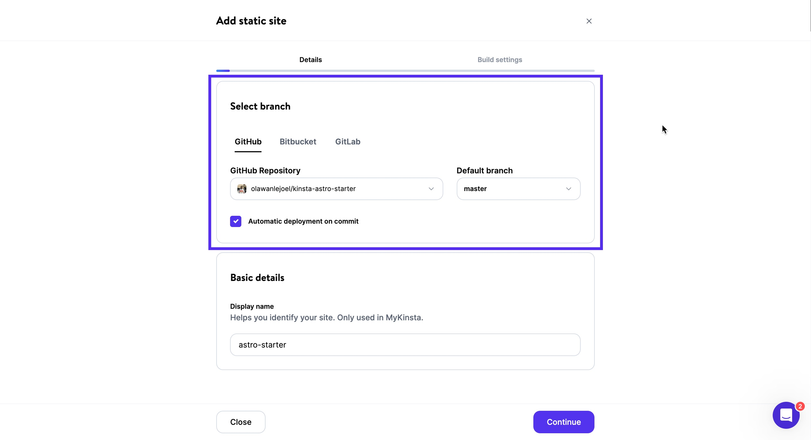

# How Kinsta Static Site Hosting Works

Kinsta Static Site Hosting operates like this:

1. You connect a repository stored on a Git provider like ([BitBucket](https://kinsta.com/docs/granting-kinsta-access-to-bitbucket/), [GitHub](https://kinsta.com/docs/authorizing-kinsta-on-github/), and [GitLab](https://kinsta.com/docs/authorizing-kinsta-on-gitlab/)) to your Kinsta account.
2. Kinsta takes your static website files and deploys them on the internet.

You have two options for deploying your static site with Kinsta Static Site Hosting:
- If your static files are in the root of your repository or in a directory within it, Kinsta will serve them directly.
- If you use a [Static Site Generator](https://kinsta.com/docs/static-site-generators/) (SSG) based on Node.js, Kinsta can build static files from your source code before serving them.